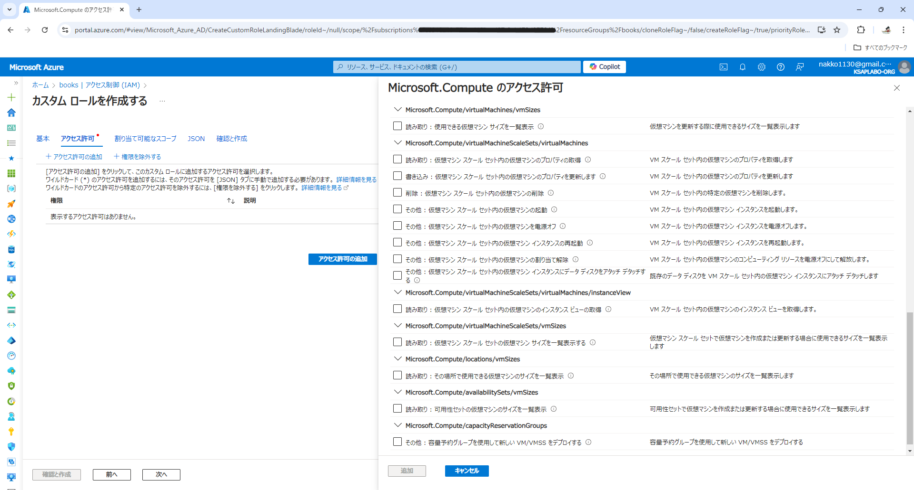
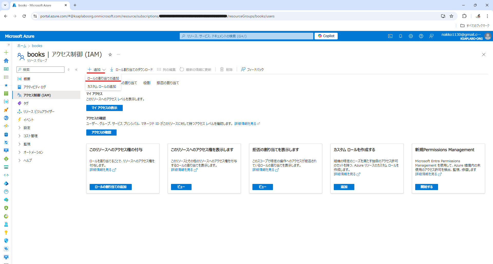
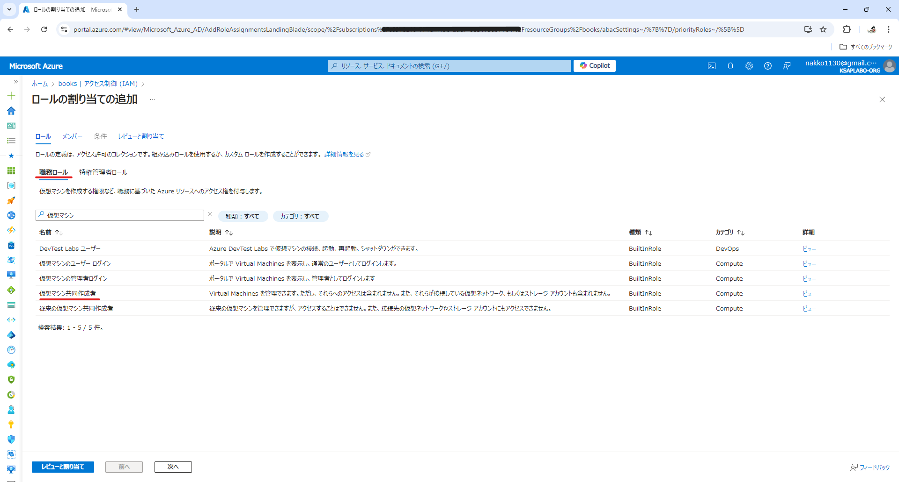
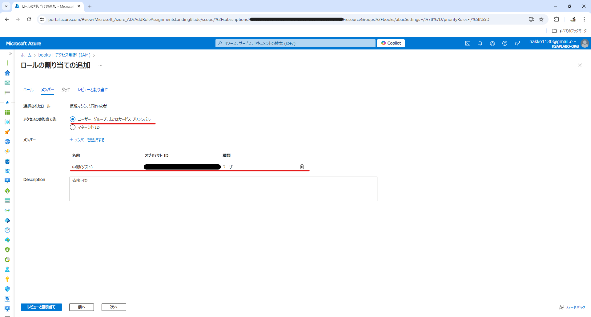
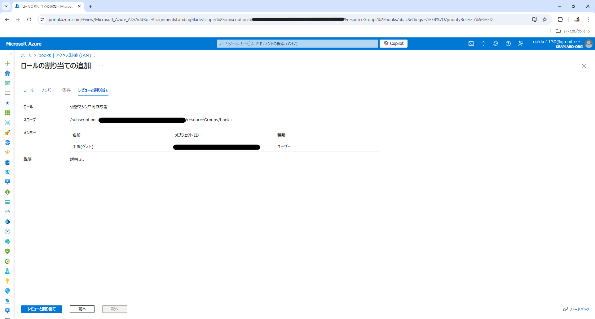
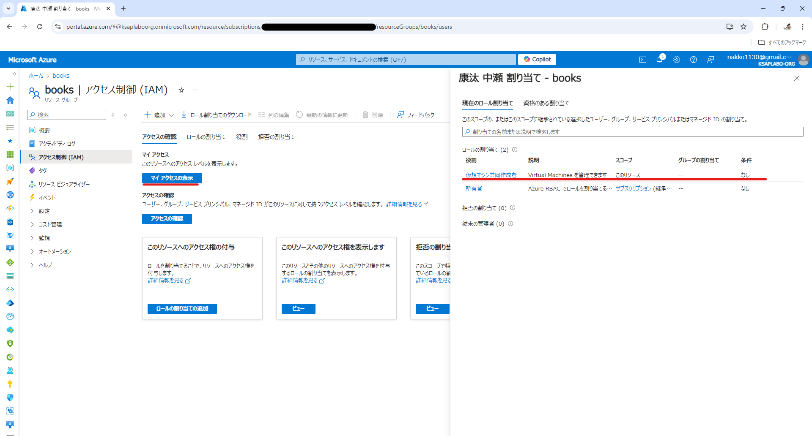

# Azure RBAC-knowledge

## RBACとは
クラウドサービスの利用において、リソースやデータに対するアクセス管理がとても重要になりますが、Azureにおいてその役割を担っている機能が 、**RBAC(Role Base Access Control)** という機能になります。  
これを用いることで、使用者の用途に合わせて必要なだけの操作を許可し、それ以外を制限する。というアクセス管理の実現が可能となります。  
具体的には、「**どのユーザーが**」、「**どのリソースに対して**」、「**何の操作を許可するか**」の三要素を指定することになります。

### Security principal
上記での「**どのユーザーが**」の部分に該当します。**ユーザー**、ユーザーの**グループ**のことです。  
他にもサービスがリソースの処理を実行するために使用する**サービスプリンシパル**などもセキュリティプリンシパルに該当します。  
このセキュリティプリンシパルに対して、ロールを割り当てることになります。

### Scope
上記での「**どのリソースに対して**」の部分に該当します。**管理グループ**、**サブスクリプション**、**リソースグループ**あるいは**リソース単体**がスコープに該当します。  
このスコープが、ロールの有効範囲を決定することになります。

### Role definition
上記での「**何の操作を許可するか**」の部分に該当します。**参照権限**、**編集権限**、**削除権限**などがロールに該当します。  
※ロールについては内容が少し複雑なため、次の章で詳しく解説します。

## リソースのロール
RBACで使用するロールは、**組み込みロール**と、**Azure カスタムロール**の2種類があります。

### 組み込みロール
Azureが用意してくれている定義済みのロールになります。大きく分けて以下の様なロールが用意されています。

|ロール名|概要|
|---|---|
|所有者|Azure RBACでロールを割り当てる権限を含め、 すべてのリソースを管理するためのフルアクセスを付与します。|
|共同作成者|すべてのリソースを管理するためのフルアクセスが付与されますが、 Azure RBAC でロールを割り当てたり、Azure Blueprintsで割り当てを管理したり、 イメージギャラリーを共有したりすることはできません。|
|閲覧者|すべてのリソースを表示できますが、変更を加えることはできません。|

上位のロールは下位の権限を内包する形になっているため、図解すると以下のような関係になります。

上記で記載したロールはAzure全般で使用するロールになるため、サブスクリプションやリソースグループに対して付与することが想定されるロールになります。  
Azureの組み込みロールはこれ以外にも、リソースの種類ごとに用意されており、**仮想マシン共同作成者**や、**ストレージBLOBデータ閲覧者**など、個別のロールが存在します。

※また、組み込みロールには、ほかのユーザーへのアクセス権限の付与と全リソースの表示のみができる「**ユーザーアクセス管理者**」と呼ばれる権限も存在します。（Az-104でよく出てきます）  
その他の組み込みロールについては、以下のドキュメントに記載されています。  
[公式ドキュメント](https://learn.microsoft.com/ja-jp/azure/role-based-access-control/built-in-roles)

### Azure カスタムロール
Azureが用意した組み込みロールが要件に対応できない場合、独自のカスタムロールを作成することができます。  
例えばAzure組み込みロールに、**仮想マシン共同作成者**というロールが存在するとお話ししましたが、こちらは、仮想マシンに対する作成・削除・実行・停止などの全てのアクションが実行できます。  
これに対してカスタムロールでは、「仮想マシンの実行・停止のみを許可する」など、特定の操作のみを許可するロールを作成することが可能です。  
また、割り当て時は組み込みロールと同様、セキュリティプリンシパルに対して割り当てが可能となります。

※カスタムロールは、JSONから作成することができますが、Azureのコンソール上でぽちぽち選択するだけで作成することもできます。

## ロールの割り当て
前章までの解説で、RBACの三要素についてお話してきました。本章では、それらを理解した上で実際にロールの作成を行っていきます。  
今回は、booksというリソースグループに対して仮想マシン共同作成者の権限を自分自身に付与するケースを実践してみます。

1. スコープの選択  
まず、「**どのリソースに対して**」を決定する、**スコープ**を決定します。
Azureコンソール上では、各リソース、グループ毎に「**アクセス制御 (IAM)**」という項目があるので、ロールを設定したいスコープでこの項目を選択します。

    選択すると、以下のような画面が表示されるので、「追加 > ロール割り当ての追加」を選択してください。これでスコープの選択は完了です。
    

2. ロールの選択  
遷移先の画面で、ロールとメンバー（セキュリティプリンシパル）の入力が求められます。

    今回は仮想マシン共同作成者のロールを付与するため、「職務ロール」から仮想マシン共同作成者を選択してください。
    

3. メンバーの選択  
次にメンバー（セキュリティプリンシパル）の入力が求められますので、このロールを付与したい対象選択します。

    今回は自分自身に割り振るため、デフォルトの設定のまま「メンバーを選択する」から自分のアカウントを指定します。（セキュリティの都合上、オブジェクトIDを隠しています）
    

4. 割り当ての確認・作成  
最後に指定した内容を確認してロールの割り当てを作成します。

    

    作成後は、以下から確認が可能です。自分自身に仮想マシン共同作成者が付与されていることが確認できました。
    

## まとめ
今回は、クラウド上のリソースへのアクセス管理を実現するための仕組みについて解説しました。  
AWSなど他のクラウドサービスでも同様の機能がありますが、最初に説明した三要素を指定する必要があることは同じはずですので、一度理解してしまえば応用を利かすことができると思います。  
また、今回は解説しませんでしたがリソースを管理するための権限の他にAzure ADを管理するためのAzure ADロールと呼ばれる機能も存在します。  
こちらの機能は、実務で触れる機会は殆どないと思いますが、Az-104では頻出の内容になりますので、受験を目指される方はそちらのほうも学習してみてください。
